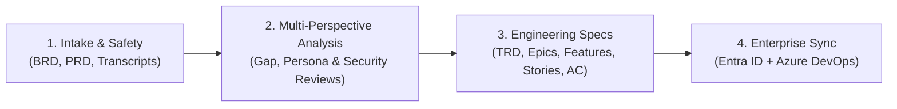
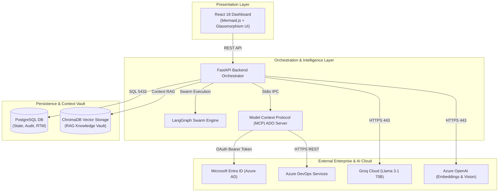
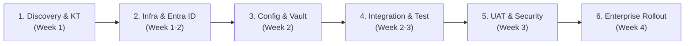
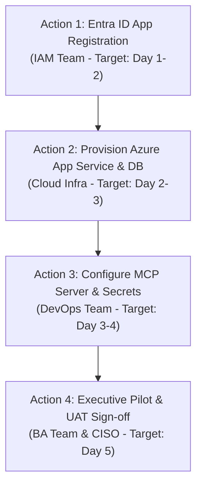

# BA Agent Pro - Executive Presentation Deck 📊
**Title**: BA Agent Pro – Intelligent Enterprise Discovery & Governance Platform  
**Target Audience**: Executive Leadership, CTO, CISO, VP of Engineering, Enterprise Solution Architects  
**Format**: Presentation Markdown (Compatible with Marp, Slide vuer, and Executive Briefings)

---

<!-- slide -->

# Slide 1: Title & Executive Summary

## 🚀 BA Agent Pro: Intelligent Enterprise Discovery & Governance
### Transforming Raw Requirements into Engineering-Ready Backlogs with AI Speed & Enterprise Governance

---

### Executive Snapshot
- **The Challenge**: Enterprise software delivery is crippled by the **"Discovery Bottleneck"**—manual requirement extraction, inconsistent user stories, missing acceptance criteria, and compliance friction.
- **The Solution**: An AI-powered multi-agent platform that automates requirement intake, gap detection, technical spec architecture (TRD), visual process modeling, and native Azure DevOps synchronization.
- **Enterprise Security Guarantee**: **100% Microsoft Entra ID (Azure AD)** authentication with **Zero PATs** (Personal Access Tokens) and active PII data masking.

---

<!-- slide -->

# Slide 2: Vision, Objectives & Expected Outcomes

## 🎯 Strategic Alignment & Business Objectives

### Why We Are Doing This
| Current Pain Points | BA Agent Pro Solution | Strategic Business Impact |
| :--- | :--- | :--- |
| **Manual Backlog Breakdown** takes weeks of senior BA time. | Multi-agent automated breakdown of BRDs into Epics, Features, and Stories in minutes. | **60% Reduction** in document-to-backlog turnaround time. |
| **Inconsistent Quality & Gaps** lead to rework during development. | Automated Gap Analysis (QA, UX, Security, & Architecture reviews). | **Zero Hallucinations** & >85% requirement quality score. |
| **Traceability & Audit Gaps** during IT compliance audits. | Automated Requirement Traceability Matrix (RTM) & immutable logs. | **100% Compliance** & complete audit readiness. |
| **Security Risks** with Personal Access Tokens (PATs). | Strict **Microsoft Entra ID Service Principal** OAuth token exchange. | Enterprise CISO & Zero-Trust alignment. |

### Key Success Metrics & Outcomes
- ⚡ **Time-to-Sprint Speed**: Requirement discovery phase accelerated from **15 days to 2 days**.
- 🎯 **Backlog Consistency**: 100% standardized User Stories formatted with Gherkin Acceptance Criteria.
- 🛡️ **Zero-Trust Security**: 0% reliance on user PATs; full auditability via Azure Entra ID.

---

<!-- slide -->

# Slide 3: Scope & Target Use Cases

## 🔍 End-to-End Functional Scope

### Core Target Use Cases
1. **BRD/PRD Document Mining**: Ingests unstructured PDFs, Word docs, and Excel sheets into structured requirement models.
2. **Meeting Transcript & Wireframe Analysis**: Processes meeting transcripts and wireframe images using multimodal vision AI.
3. **MoSCoW Prioritized Backlog Architecture**: Generates hierarchical Epics ➔ Features ➔ User Stories ➔ Gherkin Acceptance Criteria.
4. **Automated Test Case & Playwright Spec Generation**: Generates manual test suites and exportable Playwright E2E automation scripts.
5. **Bidirectional Azure DevOps (ADO) Sync**: Creates and updates work items with live status tracking.

---

<!-- slide -->

# Slide 4: In-Scope vs. Out-of-Scope Matrix

## 📋 Project Boundary & Governance Controls

| Capability Domain | In-Scope (BA Agent Pro) | Out-of-Scope (Deferred / External) |
| :--- | :--- | :--- |
| **Requirement Processing** | Ingestion of BRDs, PRDs, meeting transcripts, and wireframes. | Direct live interview recording/audio stream capture. |
| **Artifact Generation** | Functional Specs (TRD), Epics, User Stories, Acceptance Criteria, Test Cases. | Automated application source code writing/compilation. |
| **DevOps Integration** | Bidirectional sync with **Azure DevOps (ADO)** via Entra ID Service Principal. | Integration with Jira, Rally, or ServiceNow (Phase 2 Roadmap). |
| **Security & Identity** | **Microsoft Entra ID (Azure AD)** OAuth tokens, PII masking, immutable audit logs. | Personal Access Tokens (PATs) & basic username/password auth. |
| **Data Persistence** | PostgreSQL relational database + ChromaDB RAG vector memory. | Direct mutation of client core production transactional databases. |

---

<!-- slide -->

# Slide 5: Solution Architecture & Integration Landscape

## 🏗️ Enterprise Layered Architecture

---

<!-- slide -->

# Slide 6: Enterprise Security, Entra ID & Knowledge Vault

## 🔒 Zero-Trust Security & Enterprise Knowledge Architecture

### 1. 100% Microsoft Entra ID Authentication (No PAT)
- **Token Exchange**: Uses `DefaultAzureCredential` to acquire OAuth 2.0 Bearer tokens targeting Azure DevOps audience `499b84ac-1321-427f-aa17-267ca6975798/.default`.
- **Identity Governance**: App registered as `BA-Agent-Pro-ADO-Connector` in Entra ID and added to ADO Organization Settings under Service Principals (`Basic` Access Level).
- **Zero Exposure**: Eliminates individual user PAT risks, token expiration friction, and unauthorized personal access.

### 2. Zero-Knowledge Privacy Shield
- Automated pre-processing filter scrubs emails, phone numbers, IP addresses, and sensitive credentials before transmitting context to LLMs.

### 3. RAG Organizational Knowledge Vault
- Vector-encoded enterprise standards (security rules, UX design tokens, architectural guidelines) cached in ChromaDB to ground AI outputs in company standards.

---

<!-- slide -->

# Slide 7: Delivery Approach & Phased Rollout Roadmap

## 🗺️ Turnkey 6-Step Implementation Methodology

### Delivery Milestones
1. **Discovery & Knowledge Transfer**: Review existing BA template standards, ADO process templates (Agile/Scrum), and security requirements.
2. **Environment & Access Setup**: Provision Entra ID App Registration, ADO Service Principal, Azure App Service / VNet subnets, and PostgreSQL.
3. **Configuration & Key Vault Integration**: Bind Azure Key Vault secrets, configure `.env` matrix, and initialize ChromaDB Knowledge Vault.
4. **Integration & Customization**: Configure MCP ADO Server endpoints, custom work item fields, and MoSCoW prioritization logic.
5. **Validation, Security Audit & UAT**: Conduct CISO penetration testing, Entra ID token validation, and BA user acceptance testing.
6. **Enterprise Rollout & Enablement**: Production deployment, user training sessions, and continuous telemetry monitoring.

---

<!-- slide -->

# Slide 8: Governance, Key Dependencies & RACI Matrix

## 👥 Ownership & Responsibility Assignment

| Milestone / Deliverable | IAM / Security | Infra / Cloud | DevOps Team | BA / Product | CISO / Steering |
| :--- | :---: | :---: | :---: | :---: | :---: |
| **Entra ID App & SP Provisioning** | **Accountable** | Responsible | Consulted | Informed | Informed |
| **Network & Firewall Whitelisting** | Consulted | **Accountable** | Responsible | - | Informed |
| **PostgreSQL & App Deployment** | - | Consulted | **Accountable** | - | Informed |
| **ADO Work Item Mapping** | - | - | Responsible | **Accountable** | Informed |
| **UAT & Security Sign-off** | Consulted | Consulted | Responsible | Responsible | **Accountable** |

### Key Critical Dependencies
- 🔑 **Entra ID Admin Rights**: Tenant Administrator approval for App Registration & Service Principal binding.
- 🏗️ **Azure Infrastructure**: Azure Subscription access for App Service, VNet, and Flexible PostgreSQL.
- 🌐 **Firewall Whitelisting**: Outbound Port 443 access to `dev.azure.com`, `login.microsoftonline.com`, `api.groq.com`, and Azure OpenAI.

---

<!-- slide -->

# Slide 9: Immediate Next Steps & Action Plan

## 🚀 Execution Roadmap (Immediate Actions)

### Immediate Key Deliverables (Next 7 Days)
1. **Security Approval**: Formal sign-off on **Entra ID Zero-PAT policy** and outbound FQDN firewall whitelist.
2. **Infrastructure Provisioning**: Deploy core PostgreSQL database and Azure App Service instance.
3. **Pilot Kickoff**: Launch 1-sprint pilot on a select project team to measure turnaround speed and backlog quality improvement.

---

<!-- slide -->

# Slide 10: Q&A & Discussion

## 💬 Questions & Discussion

### Contact & Presentation Reference
- 📖 **Detailed Technical Installation Guide**: [`CUSTOMER_INSTALLATION_GUIDE.md`](file:///c:/Users/VMADMIN/Videos/SURYA/baagent/CUSTOMER_INSTALLATION_GUIDE.md)
- 🏛️ **Executive Management Brief**: [`EXECUTIVE_INSTALLATION_SUMMARY.md`](file:///c:/Users/VMADMIN/Videos/SURYA/baagent/EXECUTIVE_INSTALLATION_SUMMARY.md)

*Thank you for your time and leadership support!*
