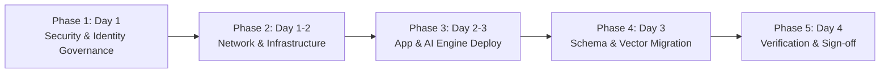

# BA Agent Pro - Executive Installation Brief & Management Summary 🏛️
**Prepared for**: IT Leadership, CISO, CTO, VP of Infrastructure, Program Management  
**Solution**: BA Agent Pro (Requify Agent Pro - Intelligent Enterprise Discovery Engine)  
**Deployment Duration**: 3 - 4 Days (Turnkey)  
**Compliance Standard**: Zero-PAT Enterprise Policy (100% Microsoft Entra ID Authentication)

---

## 🎯 Executive Overview & Value Proposition

**BA Agent Pro** is an enterprise-grade AI engine that transforms raw business requirement documents (BRD/PRD) into engineering-ready user stories, functional specifications (TRD), and visual process flows, directly integrated with Azure DevOps (ADO).

### Key Management Benefits
- **60% Turnaround Reduction**: Automates requirement breakdown and backlog creation.
- **Enterprise Governance**: Built-in Zero-Knowledge Privacy Shield masks sensitive PII before AI processing.
- **100% Entra ID Compliance**: Zero Personal Access Tokens (PATs). All ADO syncs use audited Microsoft Entra ID Service Principals or Managed Identities.
- **Complete Traceability**: Automated Requirement Traceability Matrix (RTM) linking source documents to ADO work items.

---

## 🗺️ High-Level Installation Roadmap (5-Phase Deployment)

### Phase 1: Security & Identity Governance (Day 1)
- **Objective**: Establish Entra ID authentication and eliminate PAT risks.
- **Actions**:
  1. Register `BA-Agent-Pro-ADO-Connector` in Microsoft Entra ID (Azure AD).
  2. Add Service Principal to Azure DevOps Organization Settings (`Basic` Access Level).
  3. Grant project-level `Contributor` rights in target Azure DevOps project.
- **Owner**: IAM / Security / Azure DevOps Administrator.

### Phase 2: Network & Infrastructure Provisioning (Day 1-2)
- **Objective**: Isolate application resources and establish firewall whitelisting.
- **Actions**:
  1. Provision application subnets and isolated database subnet.
  2. Configure outbound HTTPS firewall whitelist (`login.microsoftonline.com`, `dev.azure.com`, `api.groq.com`, Azure OpenAI).
  3. Provision PostgreSQL database server (`baagent_db`).
- **Owner**: Cloud Infrastructure & Network Engineering Team.

### Phase 3: Core Application & AI Engine Deployment (Day 2-3)
- **Objective**: Deploy the presentation and multi-agent backend orchestration engine.
- **Actions**:
  1. Deploy FastAPI backend server (Azure App Service / Docker / VM).
  2. Deploy React web dashboard (Azure Static Web App / Nginx / Docker).
  3. Store API keys and Entra ID secrets securely in Azure Key Vault / App Settings.
- **Owner**: DevOps / Application Engineering Team.

### Phase 4: Database Migration & Vector Vault Initialization (Day 3)
- **Objective**: Initialize relational schema and persistent RAG vector memory.
- **Actions**:
  1. Run automated database migration script (`python migrate.py`).
  2. Initialize local/mounted ChromaDB vector storage for context caching.
- **Owner**: Database Administrator / Lead Architect.

### Phase 5: Operational Verification & Compliance Acceptance (Day 4)
- **Objective**: Validate end-to-end functionality and obtain operational sign-off.
- **Actions**:
  1. Run automated health check endpoints (`/project-context`).
  2. Validate Entra ID bearer token work item retrieval (`/ado-work-items`).
  3. Perform sample BRD upload and verify live sync to Azure DevOps.
- **Owner**: Solution Architect & CISO / Enterprise Security Team.

---

## 👥 Responsibility Assignment Matrix (RACI)

| Deployment Task | IAM / Security | Infrastructure | DevOps / App Team | DB Admin | CISO / Management |
| :--- | :---: | :---: | :---: | :---: | :---: |
| **Entra ID App Registration** | **Accountable / Responsible** | Consulted | Informed | - | Informed |
| **ADO Service Principal Permissions** | **Accountable / Responsible** | Consulted | Informed | - | Informed |
| **VNet & Firewall Whitelisting** | Consulted | **Accountable / Responsible** | Informed | - | Informed |
| **PostgreSQL Database Provisioning** | - | Consulted | Informed | **Accountable / Responsible** | - |
| **App Service / Container Deployment** | - | Consulted | **Accountable / Responsible** | Informed | - |
| **End-to-End ADO Sync Verification** | Informed | Informed | **Accountable / Responsible** | - | **Sign-off** |

---

## 🔒 Security & Governance Summary

1. **Identity & Authentication**: Strict **Microsoft Entra ID (Azure AD)** Service Principal / Managed Identity authentication targeting Azure DevOps scope `499b84ac-1321-427f-aa17-267ca6975798/.default`. **Zero Personal Access Tokens (PATs)**.
2. **Data Privacy**: Built-in Zero-Knowledge Privacy Shield sanitizes emails, credentials, and PII before transmitting data to external LLM providers.
3. **Network Isolation**: Outbound traffic restricted to mandatory FQDNs (`dev.azure.com`, `login.microsoftonline.com`, `api.groq.com`, Azure OpenAI). Inbound traffic protected via WAF / Application Gateway.
4. **Audit Trail**: Every requirement extraction, analysis session, and ADO sync event is recorded in an immutable PostgreSQL audit log.

---

## 📊 Deployment Artifacts Reference

For full technical specifications, code configurations, step-by-step shell commands, and troubleshooting details, refer to:
- 📖 **Detailed Technical Installation Guide**: [`CUSTOMER_INSTALLATION_GUIDE.md`](file:///c:/Users/VMADMIN/Videos/SURYA/baagent/CUSTOMER_INSTALLATION_GUIDE.md)
