# BA Agent Pro: Solution Flow

This document maps the end-to-end orchestration flow of the Autonomous Delivery OS. You can render the Mermaid diagram below to visualize the process sequence for management presentations.

## End-to-End Orchestration Flow

```mermaid
sequenceDiagram
    autonumber
    
    actor User as Business/Product Owner
    participant Frontend as Command Center (React)
    participant Orch as Orchestrator (FastAPI)
    participant Telemetry as Telemetry Service (LLMOps)
    participant Ingest as Extraction Agent
    participant Brain as Knowledge Agent (Azure AI)
    participant Ana as Analysis & Critic Agents
    participant Arch as Architecture & TRD Agents
    participant Backlog as Backlog Gen Agent
    participant Gov as Approval Agent (ACS)
    participant Auto as Automation Agent
    participant ADO as Azure DevOps (REST)

    User->>Frontend: Uploads Material (PDF/Image/Text)
    Frontend->>Orch: POST /ingest (Multimodal Data)
    
    rect rgb(30, 30, 46)
    Note right of Orch: Phase 1: Cognitive Ingestion
    Orch->>Ingest: Extract Raw Content
    Ingest-->>Telemetry: Log Token Usage & Latency
    Ingest-->>Orch: Standardized Functional Requirements
    Orch->>Brain: Sync to Organizational Memory
    Brain-->>Orch: Vectors Stored in Azure AI Search
    end

    rect rgb(43, 27, 84)
    Note right of Orch: Phase 2: Council Analysis & Guardrails
    Orch->>Ana: Detect Ambiguities & Contradictions
    Ana-->>Telemetry: Log AI Metrics
    Ana->>Brain: Query Memory for Historical Context
    Brain-->>Ana: Similar Past Project Patterns
    Ana-->>Orch: Gap Analysis & Quality Score
    end

    rect rgb(30, 30, 46)
    Note right of Orch: Phase 3: Architectural Synthesis
    Orch->>Arch: Generate Mermaid Logic & System Diagrams
    Arch-->>Telemetry: Log AI Metrics
    Arch-->>Orch: Flow Logic
    Orch->>Arch: Draft Technical Requirements (TRD)
    Arch-->>Orch: Complete Markdown TRD
    end

    rect rgb(43, 27, 84)
    Note right of Orch: Phase 4: Agile Translation
    Orch->>Backlog: Convert TRD to Epics/Features/Stories
    Note right of Backlog: Formats ACs as HTML for ADO rendering
    Backlog-->>Telemetry: Log AI Metrics
    Backlog-->>Orch: Structured JSON Hierarchy
    Orch-->>Frontend: Display Discovery Results
    end

    rect rgb(30, 30, 46)
    Note right of Orch: Phase 5: Governance & Deployment
    User->>Frontend: Clicks "Request Formal Approval"
    Frontend->>Orch: POST /request-approval
    Orch->>Gov: Package TRD & Backlog
    Gov->>User: Sends Email via Azure Communication Services
    User->>Gov: Clicks "Authorize & Sync"
    
    Note right of Gov: Function Calling Phase
    Gov->>Auto: Initiate ADO Sync
    Auto->>Auto: LLM Autonomously Calls "search_ado" Tool
    Auto-->>Telemetry: Log Tool Execution Metrics
    Auto->>ADO: Upsert Hierarchy (Epics ➔ Tasks)
    ADO-->>Auto: 200 OK (Work Item IDs)
    Auto-->>Frontend: Display Success Dashboard
    end
```

## Flow Description

1.  **Cognitive Ingestion**: The journey begins when a user uploads raw material (a BRD document, a whiteboard photo, or a Zoom transcript). The `ExtractionAgent` standardizes this into functional requirements, and the `KnowledgeAgent` immediately embeds this data into the Azure AI Search index for long-term memory. *Every AI interaction is secretly intercepted by the `TelemetryService` to record latency and token cost.*
2.  **Council Analysis**: The `AnalysisAgent` and `AmbiguityAgent` review the raw extraction. They query the `KnowledgeAgent` to check if similar requirements exist from past projects, using that context to highlight risks, gaps, and missing compliance rules.
3.  **Architectural Synthesis**: Once the foundation is solid, the `ArchitectureAgent` generates process flows (Mermaid diagrams) while the `TRDGenAgent` drafts a comprehensive Technical Requirements Document, translating business needs into engineering constraints.
4.  **Agile Translation**: The `BacklogGenAgent` dissects the TRD into a strict hierarchical structure: Epics -> Features -> User Stories -> Tasks. It specifically formats Acceptance Criteria as HTML lists to ensure perfect rendering in Azure DevOps.
5.  **Governance & Deployment**: Before any code is tracked, the `ApprovalAgent` emails the package to stakeholders using Azure Communication Services. Only upon explicit email confirmation does the `AutomationAgent` take over. Using **Dynamic Tool Calling**, the agent autonomously queries Azure DevOps to check for duplicate Epics before executing the batch creation, establishing a flawless audit trail.
